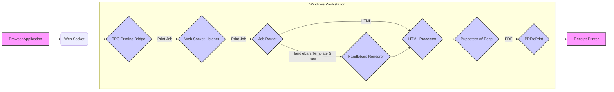

# Headless Printer Bridge Architecture

```mermaid
graph LR
    A[Browser Application] --> B(Web Socket);
    B --> C{TPG Printing Bridge};
    C -- Print Job --> D{Web Socket Listener};
    D -- Print Job --> E{Job Router};
    E -- HTML --> F{HTML Processor};
    E -- Handlebars Template & Data --> G{Handlebars Renderer};
    G --> F;
    F --> H{Puppeteer w/ Edge};
    H -- PDF --> I{PDFtoPrint};
    I --> J[Receipt Printer];

    subgraph Windows Workstation
    C
    D
    E
    F
    G
    H
    I
    end

    classDef box fill:#f9f,stroke:#333,stroke-width:2px
    classDef process fill:#ccf,stroke:#333,stroke-width:2px
    class A,J box
    class C,D,E,F,G,H,I process
```
